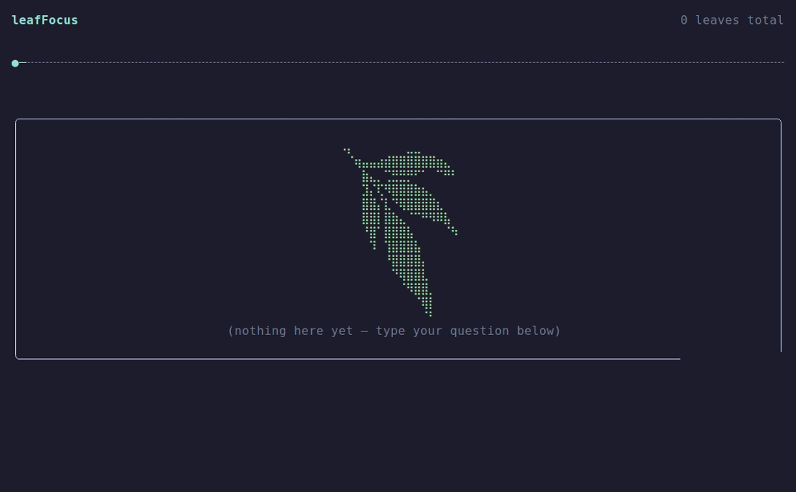

# 🍃 leafFocus

> A terminal UI for exploring answers as a **tree**, not a scrollback.

Ask a question and get back **one paragraph**, split into meaningful **segments**. Cycle through the
segments, drill into any of them, and each drill-down produces its own new paragraph + segments.
The result is a branching tree of conversation you can navigate, resume, and revisit.

[](https://github.com/DoffuXx/leafFocus/actions/workflows/ci.yml)
[](LICENSE)




## Features

- **Focused answers**: one paragraph per question, no walls of text.
- **Segmented by meaning**: every paragraph is split into verbatim chunks you can highlight.
- **Live streaming**: segments appear as they are written, not after the whole answer.
- **Drill-down branches**: ask a follow-up about any segment; it becomes a child node.
- **Persistent sessions**: every run is saved and can be resumed later (`--resume`).
- **Regenerate, delete, export**: re-ask a leaf, prune a branch, or export the session to Markdown.
- **Configurable**: choose the model and full-screen mode via a YAML file, `LEAFFOCUS_*` env vars or `.env`.
- **No API key**: uses your logged-in [`claude` CLI](https://docs.claude.com/en/docs/claude-code) in headless mode.

## Requirements

- [Bun](https://bun.sh) ≥ 1.3 (not needed for the release binaries)
- The `claude` CLI installed, on your `PATH`, and logged in (`claude login`)

## Quick start

```bash
git clone https://github.com/DoffuXx/leafFocus.git
cd leafFocus
bun install
bun run dev
```

## Release binary

Pushing a `v*` tag (e.g. `git tag v0.1.0 && git push origin v0.1.0`) builds standalone binaries for
Linux, macOS (x64/arm64) and Windows and attaches them, with `leaffocus.example.yaml`, to a GitHub
Release. No Bun needed to run them — only the `claude` CLI. Build locally with `bun run build`
(→ `dist/leaffocus`).

## Configuration

Set with command-line flags, environment variables, a `.env` file (Bun loads it automatically), or a
YAML file. Flags override env vars, which override the YAML file. The YAML file is the first found of `./leaffocus.yaml` (per project) and
`~/.config/leaffocus/config.yaml` (global; `$XDG_CONFIG_HOME/leaffocus/config.yaml` if set). Installed a binary? Run
`leaffocus --init` to create the global file from the example, then edit it. From source, copy `leaffocus.example.yaml` or `.env.example`:

```bash
cp leaffocus.example.yaml leaffocus.yaml   # or: cp .env.example .env
```

| Flag                  | YAML key       | Variable                 | Default     | Effect                                                                                |
| --------------------- | -------------- | ------------------------ | ----------- | ------------------------------------------------------------------------------------- |
| `-m, --model`         | `model`        | `LEAFFOCUS_MODEL`        | CLI default | Model passed to `claude --model`, e.g. `haiku` for faster, cheaper answers             |
| `-f, --fullscreen`    | `fullscreen`   | `LEAFFOCUS_FULLSCREEN`   | `false`     | `true` renders full-screen (alternate screen, full height); terminal restored on exit |
| `-i, --instructions`  | `instructions` | `LEAFFOCUS_INSTRUCTIONS` | none        | Standing instructions added to every answer, e.g. `Answer in French.`                 |

One-off: `bun run dev --fullscreen` or `LEAFFOCUS_FULLSCREEN=true bun run dev`.

## Usage

```bash
bun run dev            # start a brand-new session (fresh tree)
bun run dev --resume   # pick a past session to continue, like `claude -r` (short: -r)
bun run dev --help     # list all flags (short: -h); --version / -v prints the version
```

With a release binary, use `leaffocus [flags]` instead of `bun run dev`.

### Header

- **Vine** — the whole session as one ASCII branch of fixed size growing left to right: every leaf
  you ask is appended (`/^\` above, `\v/` below the stem, alternating), the path to where you are
  is green, the current leaf is filled in (`#`), and a dotted stem (`╌`) shows room to grow. When
  it no longer fits, the view slides to keep the current leaf in sight, with `…N` / `+N` counting
  the leaves cut off on each side.

### Keys

| Key                       | Action                                                 |
| ------------------------- | ------------------------------------------------------ |
| `Tab` / `↑` / `↓`         | Cycle between segments in the current paragraph        |
| `Enter` (input empty)     | Drill into the highlighted segment's existing children |
| type + `Enter`            | Ask/continue from the highlighted segment (new branch) |
| `Backspace` (input empty) | Go back up                                             |
| `Ctrl+Q`                  | Save and quit                                          |
| `←` / `→`                 | Switch between answers from the same segment           |
| `Ctrl+T`                  | Outline: type to filter, `↑`/`↓` + `Enter` to jump     |
| `Esc` (while thinking)    | Cancel the request (a typed question is kept)          |
| `Ctrl+R`                  | Regenerate the current leaf (new sibling, old kept)    |
| `Ctrl+D`                  | Delete the current leaf and its subtree (asks y/n)     |
| `Ctrl+E`                  | Export the session as Markdown                         |

On an error, `Esc`/`Enter` returns with your question still typed, so `Enter` retries.

Each answer shows how long it took and what it cost next to its question; the header shows the
session total.

## How it works

1. Your question (plus the parent paragraph and the focused segment, if any) is sent to
   `claude -p` with a JSON schema forcing `{ segments }` output.
   The output is streamed (`--output-format stream-json --include-partial-messages`), so the
   partial JSON is parsed as it arrives and the segments are previewed while the answer is written.
2. The response is validated and the segments are joined into the paragraph, so each one is a
   **verbatim** chunk of it by construction.
3. The result is added as a node in the tree and saved to disk.

The CLI runs with `--tools ''`, so it is a plain Q&A call with no file or shell access.

## Storage

| Path                               | Contents                                          |
| ---------------------------------- | ------------------------------------------------- |
| `.segment-tree/sessions/<id>.json` | One tree per session (listed by `--resume`)       |
| `.segment-tree/exports/<id>.md`    | Markdown exports (`Ctrl+E`)                       |
| `.segment-tree.log`                | JSON-lines log of every `claude` call (debugging) |

All are git-ignored. Each log entry is a `request`, then `response` or `error`, sharing a
`requestId` (with `model` and `durationMs`). Logging is best-effort: a failed write never breaks
a request.

## Project structure

```
index.tsx           # entry point
src/
  cli.ts            # command-line flags (--help, --version, --init, --resume, config overrides)
  claude.ts         # prompt building, CLI call, output parsing/validation
  config.ts         # flags / LEAFFOCUS_* env / YAML configuration
  export.ts         # Markdown export
  input.ts          # flattens typed/pasted input to one line
  outline.ts        # flattened/filtered tree for the Ctrl+T outline
  tree.ts           # tree data model + load/save
  session.ts        # session files + resume picker data
  paragraph.ts      # splits a paragraph into plain/segment spans for rendering
  trail.ts          # ASCII header: the session as one growing vine
  log.ts            # JSON-lines debug log
  types.ts          # shared types
  ui/Root.tsx       # session picker vs. running app
  ui/App.tsx        # main Ink UI
```

## Development

```bash
bun test            # run unit tests
bun run typecheck   # tsc --noEmit
```

CI runs both on every push and pull request.

## Contributing

Contributions are welcome! See [CONTRIBUTING.md](CONTRIBUTING.md).

## License

[MIT](LICENSE)
